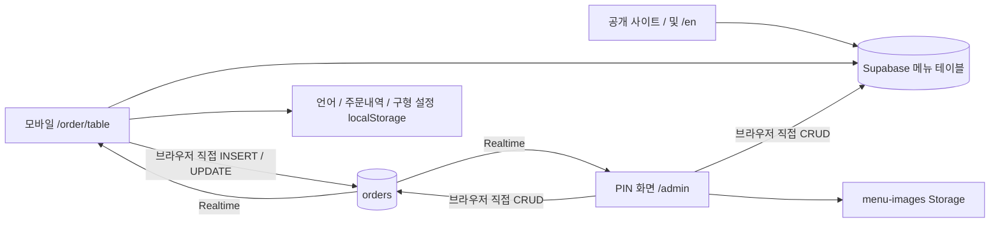
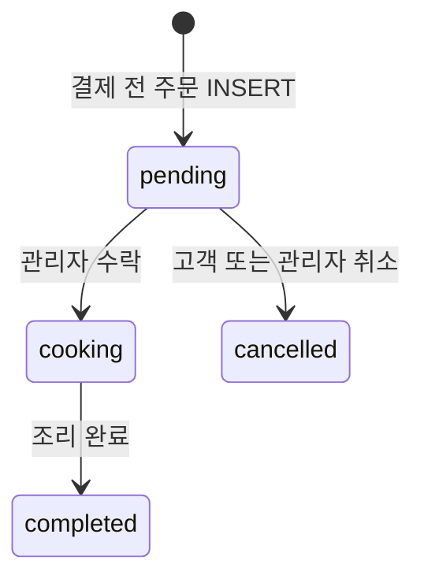
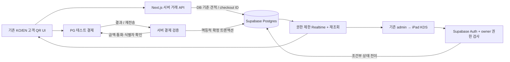

# Caffiend 2.0 — Phase 1 아키텍처 감사 및 범위 확정

점검일: 2026-09-17 · 단계: Week 3 / Phase 1 · 상태: 소스 감사 완료, 운영 DB 검증 대기

## 점검 범위와 근거

GitHub `main`을 다시 fetch했고 HEAD와 FETCH_HEAD가 모두 `ac9fcb72ecc52172d04989d6d4c3dce7d5424fb8`임을 확인했다. 앱 소스에는 이번 감사로 인한 변경이 없다. 기존 로컬 설정·문서·lockfile·public 파일 변경은 보존했다.

사용자 원문은 `CAFFIEND_2_CONTEXT.md`, `CAFFIEND_2_MASTER.md`, `CAFFIEND_2_ROADMAP.md`에 있다. 이번 작업은 아키텍처·데이터·보안·이행 계획을 문서화하는 Phase 1이다. Phase 2 인증/DB 변경, Phase 3 결제 연동, 운영 배포는 실행하지 않았다.

직접 확인한 범위: 저장소, QR/관리자/메뉴 코드, SQL migration, 설치된 Next.js 문서, 타입 검사, ESLint. 연결된 Supabase 관리 도구 및 로컬 `supabase`/`psql` 실행 파일은 발견되지 않았다. 운영 DB DDL, 실제 RLS/권한, Auth 설정, trigger/function, storage 정책, Realtime publication은 조회하지 않았다. 따라서 아래에서 **코드가 기대하는 구조**와 **실제 DB에서 확인할 사항**을 구분한다. 고객 주문 원문이나 비밀값은 수집하지 않았다.

## 1. 현재 아키텍처

- Next.js App Router / React / TypeScript / Tailwind를 유지할 수 있다. 별도 백엔드 프레임워크를 도입할 이유는 현재 없다.
- `lib/supabase.ts:19`에서 public URL/anon key로 단일 Supabase 클라이언트를 생성한다. public anon key 자체는 비밀이 아니며, 실제 데이터 보호는 RLS/권한이 담당해야 한다.
- 현재 앱에 결제 API, 서버 주문 검증, Supabase Auth 호출, 서버 owner 권한 계층은 없다.
- `/`와 `/en`은 URL 기반 언어를 사용한다. QR은 별도 언어 localStorage를 사용한다. 고객 계정 없이 주문하는 UX를 유지한다.
- `app/components/LayoutShell.tsx`는 `/order`, `/admin`을 일반 사이트 내비게이션에서 분리한다. 이 분리는 유지한다.
- 운영 UI는 `app/admin/page.tsx:50`의 `max-w-lg` 단일 열이다. iPad 가로 KDS는 Phase 5에서 이 UI를 확장한다.
- 정정: 기존 관리자에는 이미 기간별 주문내역과 완료 주문 합계가 있다(`app/admin/page.tsx:607–638`). 통계가 전혀 없는 것이 아니라, 결제 확인·테스트 분리가 없는 간이 집계다.

## 2. 현재 주문 생명주기

1. `/order`에서 1–8번 테이블을 선택하거나 `/order/[table]`로 바로 진입한다. 직접 URL 입력에 대한 서버 테이블 검증은 없다.
2. 정적 `orderMenuData.ts`를 기본값으로 사용하고 Supabase 메뉴를 한 번 조회한다. 실패/빈 데이터 시 정적 fallback이 남을 수 있다.
3. 상품의 한국어 이름을 장바구니 key로 사용한다. 옵션을 고른 같은 상품을 다시 담으면 별도 행이 아니라 기존 항목을 덮어쓴다(`app/order/[table]/page.tsx:697`).
4. 브라우저에서 항목/가격/수량/합계를 구성하고 `orders`에 `pending`으로 INSERT한다(`:659–738`). 결제 확인이나 멱등키는 없다.
5. INSERT가 성공하면 장바구니를 비우고 주문 ID 및 스냅샷을 localStorage에 저장한다. 성공 화면은 카운터 결제를 안내한다.
6. 관리자가 수락하면 `cooking`, 조리 완료를 누르면 `completed`, 대기 주문을 취소하면 `cancelled`로 직접 UPDATE한다.
7. 고객도 UI상 pending 주문을 취소할 수 있다. UPDATE 조건은 ID뿐이다(`:834`, `:929`). 수락과 취소가 경쟁하면 현재 상태를 DB에서 검사하는 장치가 소스에는 없다.
8. 관리자는 주문 기록을 실제 DELETE할 수 있다(`app/admin/page.tsx:400`). 결제 기록이 붙은 이후에는 이 동작을 유지하면 안 된다.

`completed`는 고객에게 Ready/조리 완료로 표시된다. 실제 전달 완료와 준비 완료가 합쳐져 있다. 결제 완료를 의미하지 않는다. 과거 completed 주문의 인도 시각이나 실제 지불 여부는 추정해서 채워서는 안 된다.

### Realtime 동작과 한계

| 구독 | 현재 동작 | P0 영향 |
| --- | --- | --- |
| 관리자 | 주문 화면 진입 시 전체 fetch + 모든 orders event 구독; INSERT 앞에 추가, UPDATE 기존 행 교체 | DELETE 미처리, 중복 INSERT 방어 없음, fetch와 구독 사이 누락/경합 가능 |
| 고객 | success/history 화면에서 ID별 상태 조회 + 전체 orders UPDATE 구독 후 로컬 ID 필터 | 클라이언트 필터는 권한 경계가 아님; 접근 가능한 이벤트가 먼저 전달됨 |
| 재접속 | `.subscribe()` 상태 callback/오류 UI 없음 | 앱 자체의 재접속 후 전체 동기화가 없음; SDK 연결 복구와 누락 이벤트 복원은 다름 |
| 메뉴 | 최초 fetch 중심, 메뉴 변경 구독 없음 | 이미 열린 고객 화면이 새 가격/품절을 즉시 반영하지 않을 수 있음 |

고객 history는 브라우저의 당일 기록에 의존한다. 다른 기기와 공유되지 않으며 결제 복구/권한 증명 자료로 사용할 수 없다. `CONTEXT.md`의 “await이 없으면 DB write가 종료된다”는 설명은 검증된 원인으로 채택하지 않는다. 현재 코드는 await을 하지만 반환된 오류를 무시하는 문제가 있다.

## 3. 현재 DB 가정과 localStorage

| 엔터티 | 코드에서 사용/기대하는 열 | 확인 수준 |
| --- | --- | --- |
| orders | id UUID, table_number integer, items JSONB, status text, created_at timestamptz | migration 존재. status CHECK는 pending/done뿐이며 앱과 불일치 |
| site_menu_items | id, ko, en, image_url, price, season, allergens, hidden_on_main, sort_order, updated_at | 코드만 존재; DDL/default/FK 미확인 |
| site_categories | id, ko, en, parent_id, hidden, sort_order | 코드만 존재; 계층 및 삭제 동작 미확인 |
| site_menu_category_items | menu_item_id, category_id, sort_order | 코드만 존재; 복합 unique/FK/cascade 미확인 |
| site_qr_overrides | menu_item_id, hidden, price_override, temp_mode, custom_options | upsert가 menu_item_id unique를 가정. price_override는 읽지만 현 편집기는 base price를 변경 |
| site_allergen_types | id, key, ko, en, is_custom, sort_order | 코드만 존재 |
| menu-images bucket | 이미지 upload 및 public URL | bucket 존재 여부, 공개성, 업로드 권한/크기/MIME 제약 미확인 |

`supabase/migrations/20260531000000_create_orders.sql`은 `FOR ALL USING (true) WITH CHECK (true)` 정책과 orders publication 등록을 포함한다. 이 정책이 운영에 그대로 있다면 role grants에 따라 광범위한 접근이 가능하다. **운영에 실제 적용되어 있다고 단정하지 않는다.** 폴더의 `.temp` 파일은 연결 흔적일 뿐 스키마 증거가 아니다.

`OrderItem`에는 name/quantity/price/temp/note만 선언되어 있으나 실제 고객 payload에는 `extras`도 들어간다. 표준 상품 ID, 확정 총액, 통화, payment ID, 결제 시각, 상태별 시각, 테스트 구분은 현재 주문 타입에 없다.

| 브라우저 저장 항목 | 현재 역할 | 이행 방침 |
| --- | --- | --- |
| caffiend-order-lang | 고객 언어 취향 | 로컬 유지 가능; 서버 사업 설정으로 옮길 필요 없음 |
| caffiend-order-history-{table} | 해당 브라우저 당일 주문 스냅샷과 ID | 편의 캐시만 유지; 서버의 권한 검증된 내역/결제 복구가 기준 |
| caffiend-menu-config | 이름별 prices/hidden | 사업 설정은 서버 기준으로 통합; 값을 무조건 DB로 이관하지 않음 |
| React cart state | 장바구니 | 결제 시작 전 draft 보존/복구 필요; 가격 권한은 서버 |

구형 `MenuEditor`와 `handleConfigChange`는 선언되지만 현재 admin 화면에서 연결되어 있지 않다. QR은 오래 남은 localStorage 가격을 화면 가격에 적용하지만 합계/payload는 `activeCategories` 가격을 사용한다. `hidden`은 읽히지만 QR 필터에는 적용되지 않는다. 따라서 “로컬 설정이 정상 작동하는 현재 편집기”로 설명하면 부정확하다. 이 잔존 경로를 제거/이관할 때 현재 DB 값을 우선하고 가격 불일치를 재현 확인한다.

## 4. 운영화에 직접 관련된 위험과 기술 부채

| 우선도 | 소스 근거 | 문제 / 후속 단계 |
| --- | --- | --- |
| P0 | admin/page.tsx:10,384; lib/supabase.ts | public PIN + React state는 서버 인증이 아님. Phase 2에서 세션 검증과 owner allowlist/RLS 필요 |
| P0 | orders migration: status CHECK, Allow all | 저장소만으로 현재 DB 재현 불가. Phase 2 전에 실제 DDL/권한 조사 필수 |
| P0 | order/[table]/page.tsx:659–738 | 고객이 보내는 가격/수량/테이블/옵션을 신뢰. 서버 재계산, 범위 검증, 중복 제출 방지가 결제 선행 조건 |
| P0 | order/[table]/page.tsx:574–582,697 | DB ID를 UI 모델 변환 중 버리고 이름으로 cart key 사용. 상품+옵션 조합별 line ID와 안정적 item ID 필요 |
| P0 | lib/supabase.ts:3; admin/page.tsx:162–171,782–784 | extras는 저장되지만 owner 카드/내역에는 temp/note만 렌더링. 커스텀 선택·맛·농도·로스팅이 누락되어 실제 제조 오류 가능 |
| P0 | order/[table]/page.tsx:661,677–682,766 | 변동가 -1을 합계에서 제외; 메뉴 변경 시 cartItems memo가 activeCategories 변경을 추적하지 않음; 표시/합계/제출 간 불일치 가능 |
| P0 | admin/page.tsx:390–408; customer cancellation | 먼저 UI 변경 후 DB 오류 무시; 조건부 상태 전이가 없음. 원자적 전이와 실패 복원 필요 |
| P0 | 두 Realtime 구독 | 연결/재조회/병합 정책 부족. iPad 잠금·복귀·네트워크 전환 후 동기화 필요 |
| P0 | QRMenuManager.tsx:459; QRDetailsManager.tsx:375–390; SiteMenuManager.tsx:608–629 | QR 삭제가 공유 상품 삭제; 다중 쓰기가 비원자적이며 일부 오류를 무시. 결제 스냅샷 보호 및 작업 오류 처리 필요 |
| P1 | admin/page.tsx:416,636 | 최신 500개 내역에서 completed 금액 합산; 입금 확인 없음, 테스트 구분 없음, 브라우저 시간대 사용. 매출의 근거로 부적합 |
| P1 | menu/page.tsx:229; order/[table]/page.tsx:557,600 | 조회 실패/빈 DB와 정적 fallback 구분이 약함. 상품을 숨겨도 fallback이 재등장할 수 있어 결제 시 서버 availability 재검증 필요 |
| P1 | 주문 옵션/알레르기, KO/EN menu 복제 | 여러 하드코딩 원천이 존재. 전면 통합보다 거래 경로에 필요한 부분을 우선 정합화 |

브라우저만 검사한 상태에서 다른 테이블의 주문을 읽거나 변경할 수 없는지는 실제 RLS 확인 및 역할별 테스트가 필요하다. 이번 감사에서 운영 주문을 읽거나 쓰는 방식으로 취약점을 시험하지 않았다.

## 5. 제안하는 2.0 아키텍처 — 아직 구현 아님

### 최소 책임 분리

- 기존 Next.js 안에 Route Handlers와 서버 데이터 접근 계층을 둔다. 인증은 화면 숨김이 아니라 요청/데이터 접근에서 검증한다. 브라우저용·세션 서버용·결제 검증용 privileged 클라이언트를 분리한다. Next.js 설치 문서의 async `cookies()`와 Route Handler 규칙을 따른다.
- Owner: Supabase Auth 세션 + 명시적으로 부여된 owner 자격. 회원가입 성공만으로 owner가 되지 않는다. allowlist 수정은 일반 클라이언트에서 금지한다. 이미지 업로드와 기존 모든 메뉴 CRUD도 동일 권한으로 보호한다.
- Guest: 사용자 가입 화면 없이 서버가 발급한 충분히 무작위인 주문 접근 토큰을 HttpOnly 쿠키로 보유하는 방안을 제안한다. DB에는 토큰 해시만 저장하며 URL, 로그, Realtime payload에 넣지 않는다. 주문 ID/테이블 번호만으로 조회·취소를 허용하지 않는다. 결제 redirect 시 쿠키 정책은 PG 선택 후 검증한다.
- Owner Realtime은 owner RLS로 제한한다. Guest는 서버가 토큰 확인 후 발급하는 제한된 채널 자격/서명 토큰과 최소 상태 payload를 사용하도록 설계한다. Phase 2에서 인증 경로를 검증하고, Phase 4에서 연결 복구까지 검증한다. 구현 복잡도가 커지면 인증된 상태 API polling을 복구 수단으로 사용하되 전체 주문 공개 구독은 유지하지 않는다. 필터만으로 보안을 해결하지 않는다.
- Checkout: canonical item ID/옵션/수량/테이블을 서버가 검증하고 KRW 정수 금액을 계산해 스냅샷을 고정한다. 변동가 상품은 가격 확정 전 온라인 결제에서 제외하는 것이 제안 기본값이며, 기존 카운터 주문과의 운영 정책은 결제 단계 전에 확정한다.
- 결제 재시도마다 payment attempt를 구분한다. 동일 callback/요청은 중복 주문을 만들지 않는다. DB unique 제약과 트랜잭션으로 강제한다. PG 성공 후 DB 실패 시 동일 ID로 재검증·복구 가능해야 한다. 네트워크 타임아웃을 결제 실패로 단정하지 않는다.
- 결제된 주문의 즉시 취소를 단순 status UPDATE로 처리하지 않는다. 환불 기능(P2) 전까지 고객 자동 취소는 비활성화하고 직원 확인을 안내하는 정책을 제안한다. PG 결제창 취소(Phase 3)는 별도 처리다.

### 상태 모델 제안

- Fulfillment: `pending → preparing → ready → completed`, 가능한 취소는 서버가 전이 가능 여부와 결제 상태를 검사한다. Accept는 preparing 진입이므로 별도 accepted 상태는 불필요하다.
- Payment attempt: `pending / paid / failed / cancelled`; 미결제·기존 카운터 주문은 paid로 소급 처리하지 않는다. 환불 기록 지원 여부는 후속 단계에서 확장한다.
- 결제 전 draft는 checkout으로 보관한다. 결제가 검증되면 원자적으로 payment를 확정하고 order를 한 번 생성한다. 미결제 checkout은 KDS NEW에 나타나지 않는다.
- 구 주문 `cooking`은 preparing에 대응한다. 기존 completed는 legacy completed로 보존하고 “실제 인도 확인”으로 해석하지 않는다. `done`이 실제 DB에 있으면 건수/의미를 먼저 확인한다.
- Owner 매출은 검증된 실제 결제에서 계산하고 sandbox, 미결제, 실패, 취소/환불 금액을 분리한다. 주문 수/AOV/best seller/peak hour의 대상도 동일 기준으로 명시한다. 카운터 과거 합계는 별도 legacy 지표로만 유지한다. 영업일 경계는 Asia/Seoul 기준으로 통일한다.

## 6. 필요한 DB migration 계획 — 실행 금지 / Phase 2 설계 입력

| 순서 | 변경 계획 | 데이터 보존·의존성 |
| --- | --- | --- |
| M0 조사 | 실제 schema, constraints, indexes, grants, RLS, triggers/functions, publication, bucket 정책 확인; backup 및 staging 확보 | 아래 catalog SQL은 읽기 전용. 현재 자료만으로 테이블을 재생성하지 않음 |
| M1 기준선 | 기존 메뉴 테이블/관계/정책을 실제 DDL 기준으로 versioning | 적용 이력을 reconcile. 과거 migration 재실행 금지; cascade 동작 확인 |
| M2 owner | owner allowlist 및 세션 연동에 필요한 권한 함수/정책 설계 | Auth user ID를 운영자가 부여; 자기 권한 상승 금지; function EXECUTE와 search_path 검토 |
| M3 데이터 확장 | checkouts, payment attempts; orders에 canonical total/currency, checkout 연결, 새 fulfillment 상태 및 상태 시각, source/test 구분 | 기존 items JSONB 보존. 새 항목에 item ID/KO·EN 이름/가격/옵션 스냅샷 추가. 과거 paid_at 등은 NULL |
| M4 제약 | checkout idempotency key, provider transaction ID의 적절한 unique; 결제 확정 함수; 허용 상태/양수 수량/금액 제약 | 기존 불일치 데이터를 먼저 조사. 하나의 checkout은 최대 하나의 order. confirmed amount는 스냅샷과 일치 |
| M5 권한 cutover | guest 직접 주문 CRUD 차단; owner·guest 서버 경로 및 storage/RLS 권한 적용 | 기존 QR/owner 코드와 함께 전환해야 함. 정책만 먼저 바꾸어 기존 고객 주문을 중단시키지 않음 |
| M6 정리 | 구 localStorage override·PIN·구 쓰기 경로 제거, 필요 index 추가 | staging 승인 후 배포; 이전 호환 경로 제거를 마지막에 수행 |

제안 엔터티 세부: orders는 기존 PK와 JSONB를 유지하고 total_amount(KRW), currency, fulfillment 상태, accepted_at/ready_at/completed_at, source/legacy 표시를 추가한다. checkout은 서버 견적 스냅샷, 만료 시각, guest 토큰 해시, 멱등키를 가진다. payment attempt는 checkout FK, provider/mode, provider payment ID, amount/currency, status, method, paid_at과 검증 시각을 가진다. 민감한 카드 정보나 불필요한 PG 전체 응답은 저장하지 않는다. payment_status는 검증된 payment에서 도출하고, orders에 복제할 경우 동일 DB 트랜잭션에서만 갱신한다. exact DDL은 운영 조사 후 확정한다.

사업 설정은 기존 site_menu_items/site_qr_overrides를 활용하고 가격·가용성을 하나의 서버 규칙으로 해석한다. 새 store_settings 테이블은 실제 전역 설정이 필요할 때만 추가한다. 품절 필드는 Phase 5에서 추가할 수 있으며 숨김·삭제와 구분한다.

롤백: 변경 전 backup 및 staging 복원 연습 → additive DB 변경 → 호환 앱 배포 → 역할별 검증 → cutover 순서. 새 결제 데이터가 생긴 뒤에는 컬럼/테이블 삭제식 rollback을 하지 않는다. checkout 진입 중단과 재검증/복구 경로를 유지하고, 미확정 결제의 정산이 끝난 뒤 처리한다. 보호된 데이터를 다시 공개하는 방식으로 롤백하지 않는다.

## 7. 정확한 단계별 구현 순서와 범위 동결

| 단계 | 실행 순서 / 산출물 | 다음 단계 진입 조건 |
| --- | --- | --- |
| Phase 1 / Week 3 | 소스 감사 → scope freeze → DB 확인 목록 → migration/검증 계획 | 본 문서 작성 완료. live DB 항목은 미확인으로 남기고 Phase 2 착수 전 해소 |
| Phase 2 / Week 4 | ①실제 DB/backup ②확장 schema·타입 ③Auth 세션/owner allowlist ④guest 권한 경로 ⑤RLS·Storage 및 기존 CRUD 연결 ⑥상태 전이·오류 처리/옵션 스냅샷 | owner 로그인 및 비-owner 차단, 기존 KO/EN 주문 회귀 통과, 결제 저장 모델 준비. PG 결제는 아직 구현하지 않음 |
| Phase 3 / Week 5 | ①PG 테스트 설정 ②서버 견적/checkout ③결제창/redirect ④서버 검증 ⑤실패·취소·중복·금액 불일치 검증 | 실제 sandbox 테스트 한 건의 서버 검증 및 복구 확인 |
| Phase 4 / Week 6 | ①결제 확정→단일 order ②owner 수신/수락 ③고객 상태 ④재접속·재조회·경합 ⑤전체 transaction 회귀 | 수동 DB 조작 없이 전화기→결제→owner 수락→고객 반영 |
| Phase 5 / Week 7 | tablet KDS 3열, 준비/전달 분리, extras 표시, 가용성/품절 | 실제 iPad 조작 검증 |
| Phase 6 / Week 8 | manifest/icon/standalone, 기본 통계, 가능한 신뢰성 있는 알림 | 홈 화면 실행 + 결제 기반 지표. 테스트 매출 분리 |
| Phase 7 / Week 9 | 카페 파일럿 및 피드백 수집, 필요 수정 | 실제 장치/망/KO·EN 확인. 안정적일 때만 선택적 앱 패키징 |
| Phase 8 / Week 10 | 기능 동결, 오류/운영 안정화, 전후 비교/측정 결과 | 실측과 테스트 데이터 구분, 한계와 향후 과제 기록 |

현재 승인 범위는 **Phase 1만**이다. 각 후속 단계는 사용자 지시 후 착수한다. 공개 사이트 전면 리뉴얼, 미완성 브랜드 페이지 작성, 고급 BI, 고객 계정/앱, React Native, 멀티매장 등은 이번 감사에 편승해 구현하지 않는다.

Phase 2 예상 영향 파일: `lib/supabase.ts`, 신규 browser/server Supabase helper와 owner 접근 계층, `app/admin/page.tsx` 및 세 메뉴 편집기, `app/order/[table]/page.tsx`, 공유 주문 타입/상태 helper, 새 migration. Phase 3는 checkout/verify route와 고객 결제 화면을 추가한다. Phase 5/6 UI·PWA 파일은 그 단계까지 보류한다.

## 검증 결과와 후속 확인

- `npx.cmd tsc --noEmit --incremental false`: 통과(exit 0).
- `npm.cmd run lint -- --format json --output-file D:/Caffiend/phase1-eslint.json`: 실패(exit 1), 58개 파일에서 **오류 10 / 경고 31**. 기존 문제이며 이번 문서 작업으로 생긴 것이 아니다.
- 오류 파일: admin/page.tsx(3), components/AllergyTable.tsx(1), components/Nav.tsx(3), components/ScrollProgressBar.tsx(1), order/AllergySheet.tsx(1), order/page.tsx(1). 효과 내부 상태 변경·불변성·내부 링크 규칙 등이 포함된다. 후속 수정 때 touched 경로의 회귀와 분리해서 관리한다.
- package.json에 test script 없음; 앱 테스트 파일을 검색했으나 발견하지 못함(Playwright 패키지는 설치되어 있음).
- 이번 감사는 앱 변경이 없으므로 production build나 실제 주문 생성/취소 테스트는 실행하지 않았다. 이전 HTTP 200 결과는 이번 감사의 end-to-end 검증이 아니다.
- 후속 역할별 검증: 비로그인/비-owner는 관리 쓰기 금지, guest A는 guest B 주문 접근 금지, owner는 필요한 CRUD만 허용, 서버 금액 위조 방지, 옵션 스냅샷 보존, 중복 확정 단일 주문, 수락/취소 경합, 재접속 복원, 변동가 차단/안내, KO/EN 기능 일치.

운영 DB를 확인하려면 `phase-1-schema-inventory.sql`의 metadata 결과가 필요하다. PG 선택/테스트 계정은 Phase 3 의존성, owner 계정 및 staging 환경은 Phase 2 의존성이다. 비밀키를 채팅이나 문서에 붙여넣지 말고 해당 환경에 설정한다. 실제 DB 확인 전에는 Phase 1의 **운영 DB 검증까지 완료했다고 표시하지 않는다.**

## 참고한 공식 기술 문서

- 설치된 Next.js 16.2.2: `node_modules/next/dist/docs/01-app/02-guides/authentication.md`, `01-getting-started/15-route-handlers.md`, `03-api-reference/04-functions/cookies.md` — 요청별 접근 계층 검증, Route Handlers, async cookies 확인.
- [Supabase SSR 클라이언트](https://supabase.com/docs/guides/auth/server-side/nextjs): browser/server 클라이언트와 검증된 identity 사용. 세션 데이터만으로 owner 권한을 판단하지 않는다.
- [Supabase Postgres Changes](https://supabase.com/docs/guides/realtime/postgres-changes): 후속 구현에서 RLS/구독 권한 및 필터를 함께 검증할 기준. 현재 운영 설정 확인의 대체 자료가 아니다.
